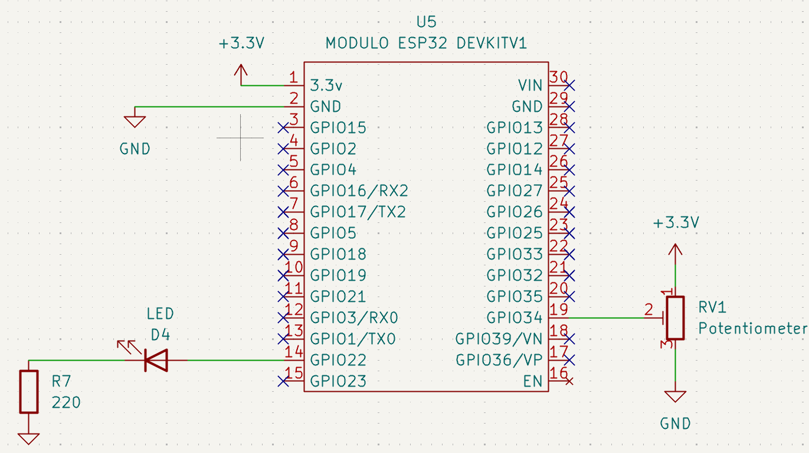
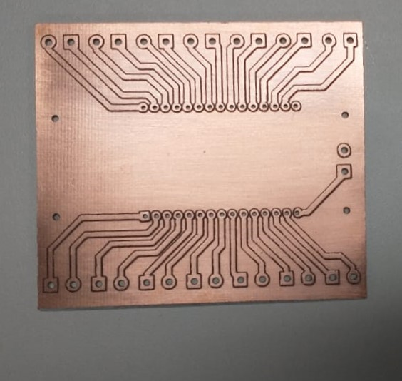
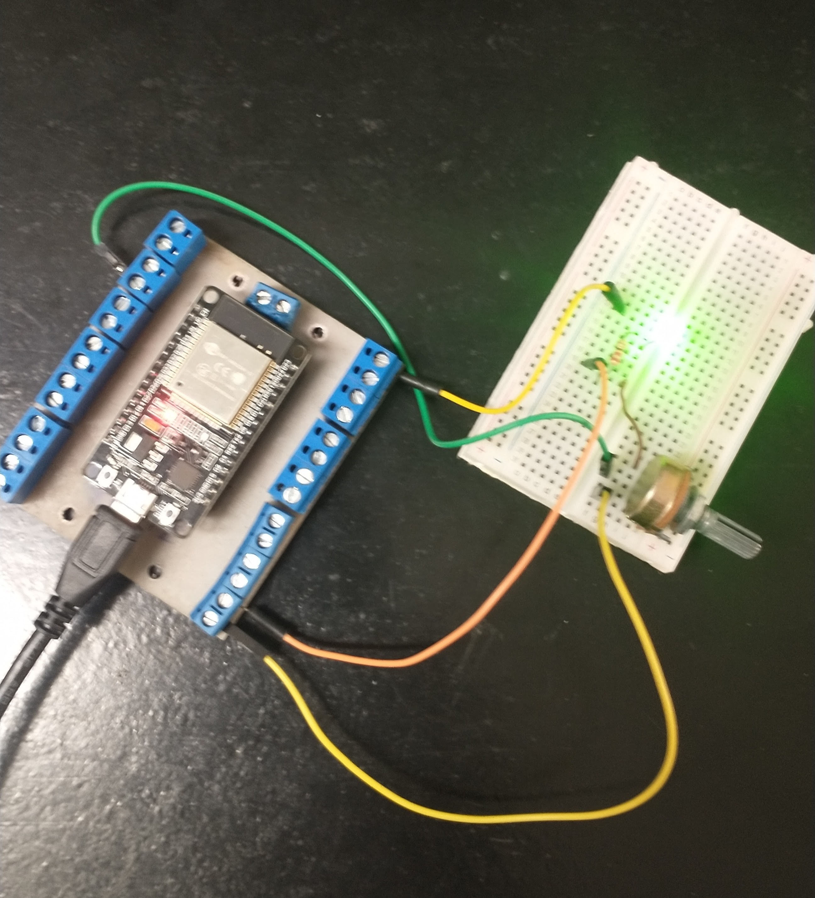

# 📑 Arquivos Gerber 

Esta pasta contém os arquivos de fabricação no formato **Gerber** (gerados através do software *KiCad*) para o projeto utilizado no ensaio prático de usinagem da máquina CNC desenvolvida neste TCC.

## 🔬 Descrição do Circuito de Teste

Para validar a funcionalidade prática da placa usinada, projetou-se um circuito de controle de intensidade luminosa (brilho) de um LED através de modulação por largura de pulso (PWM), controlado por um potenciômetro analógico e gerenciado por um microcontrolador **ESP32**.

### 📌 Mapeamento de Pinos (Pinout)
* **Potenciômetro (Entrada Analógica):** Conectado à porta **GPIO 34** (ADC) do ESP32.
* **LED (Saída PWM):** Conectado à porta **GPIO 22** com resistor de limitação de corrente.

---

## 🗺️ Documentação Visual

### 1. Esquemático Elétrico
O circuito foi estruturado no KiCad conforme o diagrama abaixo:

### 2. Resultado da Usinagem (Placa Bruta)
Após o processamento do Gerber no software *FlatCAM* e execução do código G na Router CNC, a placa apresentou isolação perfeita e trilhas com acabamento sem rebarbas:

### 3. Circuito Montado e Funcional (Validação Final)
Validação prática com os componentes soldados, testes de continuidade/isolamento aprovados no multímetro e o firmware do ESP32 executando o controle de brilho perfeitamente:

